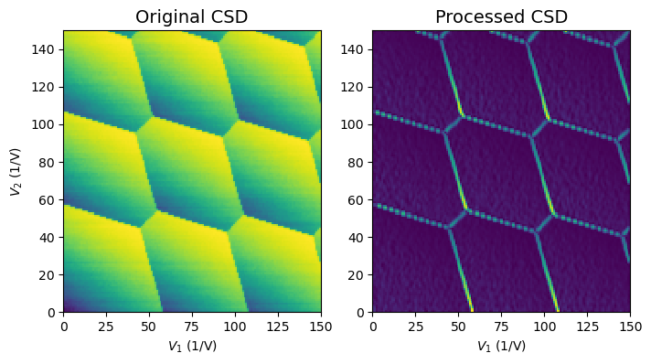
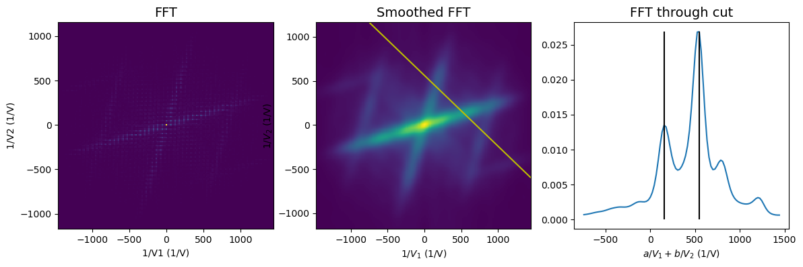
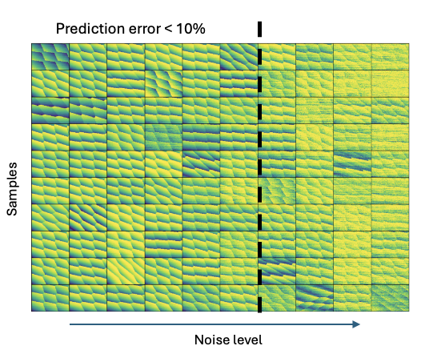
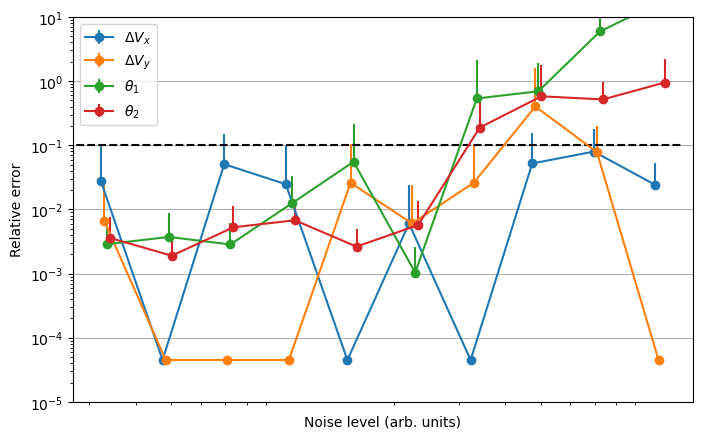

# ftt-charge-stability-diagram
We use Fourier transform to identify parameters of semiconductor Quantum dot systems from charge stability diagrams

Blog post: qplai.liacs.nl/index.php/2025/01/13/autonomous-extraction-of-semiconductor-quantum-dot-parameters-using-a-basic-fourier-transform-approach/

### Example

### Performance
Data

Error

## How to run?
1. Download the dataset from https://leidenuniv1-my.sharepoint.com/:u:/g/personal/krzywdaja_vuw_leidenuniv_nl/EccqnFnrldFDreY5xaaeRVEBOGKyDFh6RZMv1QUsemxrHQ?e=RX60mY and place into code/data folder
2. Run the code in example 

or 
1. Clone the QDarts from https://github.com/condensedAI/QDarts
2. Generate data using code/data_gen.ipynb
3. Run the code in example

or 
1. Import your CSD as arrays and voltages as vectors
2. Run the code in example

### Cite:
